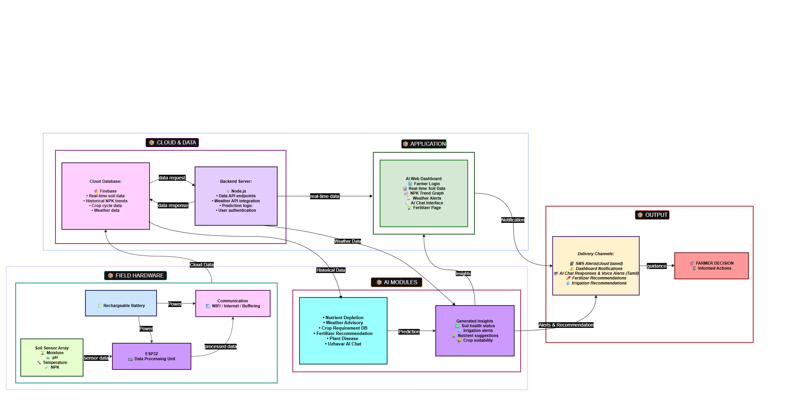

# Agro-Sense

Agro-Sense is a full-stack smart agriculture platform for farmers and agronomy workflows. It combines:

- Real-time and historical farm/sensor insights
- NPK prediction and fertilizer planning
- Crop recommendation and disease diagnosis
- Alerts and weather-aware advisories
- A bilingual (English/Tamil) AI assistant chat

The project uses a React + Vite frontend, an Express backend, Firebase services, and Python/TensorFlow scripts for crop disease ML tasks.

---

## 1) Architecture

### System architecture (PNG)



---

## 2) Tech Stack

### Frontend
- React (Vite)
- Tailwind CSS
- Framer Motion
- React Router
- i18next (Tamil/English)
- Firebase client SDK (Auth, Firestore, Realtime DB, Storage)

### Backend
- Node.js + Express
- nodemon (development auto-reload)
- Firebase Admin SDK
- Google Generative AI SDK (Gemini)
- Web Push notifications
- Multer for image upload
- TensorFlow.js Node runtime
- ML Random Forest (for NPK related logic)

### Dev Tooling
- concurrently (root-level parallel frontend + backend dev run)

### Python ML
- TensorFlow
- TensorFlow.js converter
- NumPy
- Pillow

---

## 3) Repository Structure

```text
Agro-Sense/
├─ backend/                  # Express server + services + ML integration
│  ├─ config/
│  ├─ middleware/
│  ├─ models/                # Saved model files and labels
│  ├─ scripts/               # Python inference/training scripts
│  ├─ services/              # Domain services (weather, alerts, advisory, etc.)
│  ├─ server.js
│  └─ requirements.txt       # Python dependencies (pinned)
├─ frontend/                 # React UI
│  ├─ public/
│  └─ src/
├─ Crop___Disease/           # Image dataset by crop and disease class
├─ Data Set/                 # Tabular datasets used by model/service logic
├─ images/                   # Architecture diagrams and docs assets
└─ package.json              # Root scripts to run frontend + backend together
```

---

## 4) Prerequisites (from scratch)

Install these first:

1. **Node.js 20+** (includes npm)
2. **Python 3.10 or 3.11** (recommended for TensorFlow compatibility)
3. **Git**
4. (Recommended) **VS Code**

Optional but commonly needed:
- Firebase project (for Auth/Admin + DB usage)
- OpenWeather API key (weather endpoints)
- Gemini API key (assistant chat)

---

## 5) Clone and Install

From a clean machine:

```powershell
git clone <your-repo-url>
cd Agro-Sense
npm install
cd backend
npm install
cd ..\frontend
npm install
cd ..
```

Run all commands from the repo root (`Agro-Sense`) unless a step explicitly says otherwise.

---

## 6) Python Environment for ML

Create and activate a virtual environment in repo root:

```powershell
python -m venv .venv
.\.venv\Scripts\Activate.ps1
pip install --upgrade pip
pip install -r backend\requirements.txt
```

Pinned packages in `backend/requirements.txt` are used so other developers get consistent Python package versions.

This step is required before first backend run. If skipped, crop-disease inference fails with errors like `ModuleNotFoundError: No module named 'PIL'`.

---

## 7) Environment Variables

This repository already includes template files:

- `backend/.env.example`
- `frontend/.env.example`

Create local env files from templates:

```powershell
Copy-Item backend/.env.example backend/.env
Copy-Item frontend/.env.example frontend/.env
```

Then update values in both `.env` files for your own machine and keys.

Important:
- Replace any placeholder/example API keys before production use.
- Keep real secrets only in local `.env` (or your deployment secret manager), not in git.

---

## 8) Run in Development

Before running, ensure you completed all of these:
- `npm install` in root, `backend`, and `frontend`
- env files copied from `.env.example`
- Python venv created and `pip install -r backend\requirements.txt` completed

### Option A: Run both frontend and backend from root

```powershell
npm run dev
```

This runs backend + frontend concurrently.

Implementation detail:
- Root `npm run dev` uses `concurrently` to launch both apps.
- Backend `npm start` uses `nodemon` for automatic restart on file changes.

### Option B: Run separately

Terminal 1:
```powershell
cd backend
npm start
```

Terminal 2:
```powershell
cd frontend
npm run dev
```

Frontend default URL: `http://localhost:5173`  
Backend default URL: `http://localhost:5000`

---

## 9) Build for Production

```powershell
npm run --prefix frontend build
```

The backend can serve frontend build files from `frontend/dist` if they exist.

---

## 10) Python ML Workflows

### A) Crop disease inference
The backend uses Python scripts (`backend/scripts/`) and model files under `backend/models/`.

- `predict_crop_disease.py`: one-shot inference
- `predict_crop_disease_daemon.py`: persistent daemon for lower-latency repeated inference
- `train_crop_disease.py`: training pipeline

### B) Convert Keras disease model to TensorFlow.js

From root:

```powershell
npm run convert-model
```

This executes `backend/convert_crop_disease_to_tfjs.py`.

### C) Model/data expectations

- Disease model expected at: `backend/models/crop_disease_model.h5`
- Disease labels expected at: `backend/models/crop_disease_labels.json`
- Dataset fallback source: `Crop___Disease/` directory

---

## 11) Key Backend API Endpoints

### Health and system
- `GET /` → backend status message
- `GET /api/health` → uptime, model metadata, Firebase status

### Push notifications
- `GET /api/push/public-key`
- `POST /api/push/subscribe` (auth)
- `POST /api/push/notify` (auth)

### Disease + agronomy
- `POST /api/crop-diagnosis` (auth, image upload)
- `POST /api/predict-npk` (auth)
- `GET /api/npk/live-sensor` (auth)
- `GET /api/npk/latest` (auth)
- `GET /api/npk/history` (auth)
- `GET /api/npk/model-info`
- `POST /api/fertilizer/plan` (auth)
- `POST /api/crop/recommend` (auth)
- `GET /api/alerts` (auth)
- `GET /api/demo/summary` (auth)

### AI assistant
- `POST /chat`

---

## 12) Authentication and Firebase Notes

- Most agronomy endpoints are protected with Firebase ID token bearer auth.
- Backend verifies token via Firebase Admin middleware.
- For local testing, ensure frontend login flow is functional and sends `Authorization: Bearer <token>`.
- If Firebase Admin credentials are missing, some endpoints return service-unavailable responses by design.

---

## 13) Known Setup Pitfalls

1. **TensorFlow on unsupported Python version**  
   Use Python 3.10/3.11 for best compatibility.

2. **Backend starts but disease inference fails**  
   Ensure `.venv` exists and required model files are present.

3. **Chat returns quota/rate-limit errors**  
   Validate `GEMINI_API_KEY` and provider quota limits.

4. **Weather/advisory data is limited**  
   Add `OPENWEATHER_API_KEY` and check network egress.

5. **Auth-protected endpoints return 401**  
   Verify Firebase login and bearer token forwarding.

---

## 14) Data and Secrets Hygiene

Recommended for team collaboration:

- Never commit real service account keys or production secrets.
- Keep secrets in local `.env` / deployment secret manager.
- Share only template config values in documentation.
- Rotate keys immediately if exposed.

---

## 15) Suggested First-Time Validation Checklist

After setup, validate in this order:

1. `GET /api/health` returns `status: ok`
2. Frontend loads and login works
3. NPK prediction endpoint works from UI
4. Disease diagnosis upload works
5. Alerts and assistant chat work

If all five are working, your local project is correctly configured end-to-end.

---

## 16) Useful Scripts (Quick Reference)

From project root:

- `npm run dev` → run frontend + backend
- `npm run backend` → backend only
- `npm run frontend` → frontend only
- `npm run convert-model` → convert disease model to TFJS
- `npm run dev:convert` → convert + run full stack

From backend:

- `npm start` → run backend with nodemon

From frontend:

- `npm run dev` → run frontend dev server
- `npm run build` → production build
- `npm run preview` → preview build

---