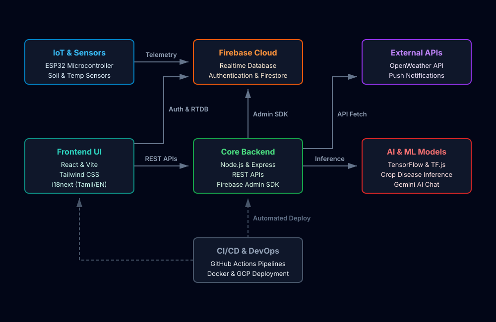

# AgroSense - Full Stack Smart Agriculture Platform

[View Demo Here](https://drive.google.com/file/d/1XYJ13Ht18DxKSGdpi3ZsPNquugjvv1MO/view?usp=drive_link)

AgroSense is a comprehensive, full-stack smart agriculture ecosystem designed to empower farmers with real-time data, AI-driven insights, and seamless agronomy workflows.

## 🚀 Key Features

*   **Real-Time IoT Monitoring:** Integrated ESP32-based sensor networks continuously track soil moisture, NPK values, and temperature, syncing data to Firebase Realtime Database with sub-200ms latency.
*   **AI Crop Disease Diagnosis:** Leverages TensorFlow and TF.js models optimized via ONNX (cutting inference latency by 40%) to accurately diagnose crop diseases from uploaded images.
*   **NPK Prediction & Fertilizer Planning:** Data-driven algorithms analyze soil metrics to predict NPK requirements and generate customized fertilizer schedules.
*   **Bilingual AI Assistant:** Built-in chat assistant powered by Google Gemini AI, offering interactive agricultural support in both English and Tamil.
*   **Weather-Aware Advisories:** Integrates OpenWeather API to provide localized weather forecasts and push notifications for urgent agronomy alerts.
*   **Robust Cloud Infrastructure:** Fully automated CI/CD pipelines using GitHub Actions, with backend and frontend services containerized via Docker and deployed on Google Cloud Platform (GCP) for high availability and scalability.

## 🏗️ System Architecture

Our platform utilizes a modern, decoupled architecture ensuring low latency and high scalability across IoT, Frontend, Backend, and Cloud layers.



## 🛠️ Tech Stack

*   **Frontend:** React (Vite), Tailwind CSS, Framer Motion, i18next
*   **Backend:** Node.js, Express, Firebase Admin SDK
*   **Cloud & DB:** Firebase (Auth, Firestore, Realtime DB), Google Cloud Platform (GCP)
*   **AI & ML:** TensorFlow, TensorFlow.js, Python, Google Gemini SDK
*   **DevOps & IoT:** Docker, GitHub Actions, ESP32 Microcontrollers

## ⚙️ Quick Start: Clone and Run

Follow these minimal steps to get the project running locally. 

**Prerequisites:** Node.js 20+, Python 3.10+, and Git.

### 1. Clone the repository
```powershell
git clone <your-repo-url>
cd Agro-Sense
```

### 2. Install dependencies
```powershell
# Install root, backend, and frontend dependencies
npm install
cd backend
npm install
cd ..\frontend
npm install
cd ..
```

### 3. Setup Python ML Environment
```powershell
# Create and activate virtual environment
python -m venv .venv
.\.venv\Scripts\Activate.ps1

# Install required ML packages
pip install --upgrade pip
pip install -r backend\requirements.txt
```

### 4. Configure Environment Variables
Copy the templates and add your API keys (Firebase, OpenWeather, Gemini):
```powershell
Copy-Item backend\.env.example backend\.env
Copy-Item frontend\.env.example frontend\.env
```

### 5. Run the Application
Run both the frontend and backend concurrently from the root directory:
```powershell
npm run dev
```